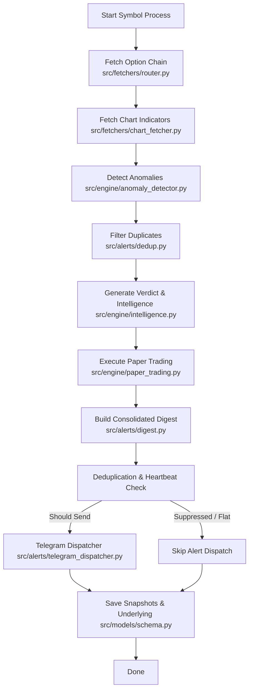
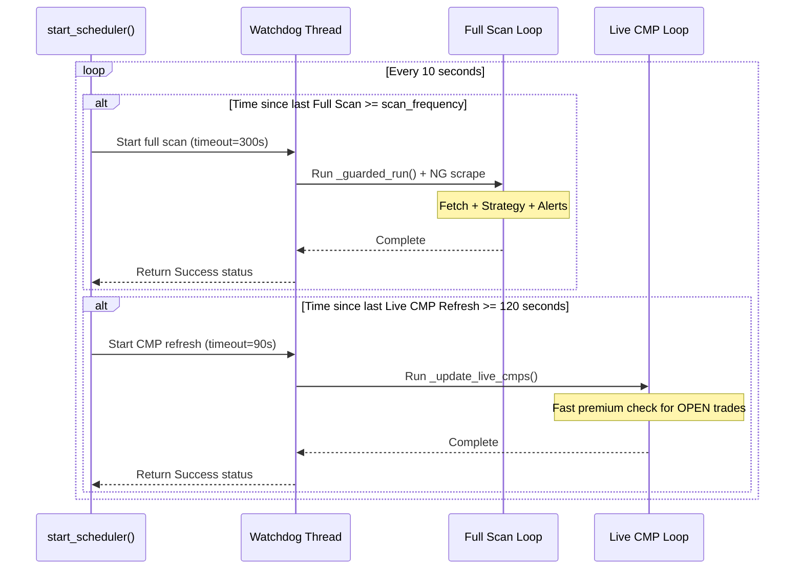
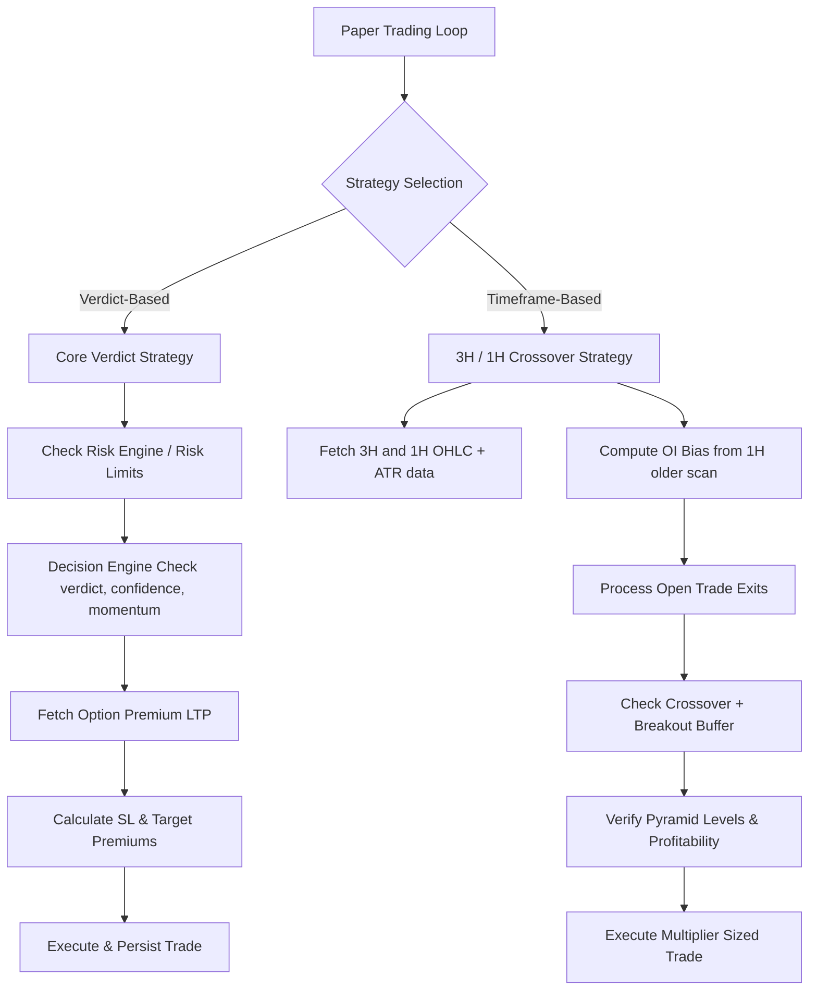

# Architecture

This document describes the system architecture, design patterns, loops, and data flows of the NSEBOT trading system.

---

## 1. Pipeline Orchestrator Pattern
The system is built around a linear data processing pipeline running on a regular cycle. This **Pipeline Orchestrator** is implemented in `src/engine/pipeline.py` (via `run_pipeline` and `_process_symbol`).

### Key Stages:
1. **Fetch**: Fetches option chain data from the best available source (Dhan, Paytm, NSE, or Upstox) using prioritized fallback routing. Server-side chart fetcher runs concurrently to fetch candle OHLC and indicators (1h and 3h timeframes) without requiring a browser.
2. **Detect**: `anomaly_detector.py` evaluates pure-function mathematical rules to detect volume spikes, OI shifts, and premium pricing anomalies against the previous snapshot.
3. **Dedup**: Suppresses alerts triggered in close temporal proximity (cooldown window of 60 mins) to prevent notification fatigue.
4. **Verdict & Intel**: Summarizes options sentiment, builds TradingView-style news scoring, and assigns bullish/bearish verdicts with confidence ratings.
5. **Paper Trading Engine**: Decides whether to enter, exit, hold, or pyramid trades based on active risk controls and decision trees.
6. **Digest & Dispatch**: Compiles anomalies, strategy execution results, and indicators into a single structured Telegram message.
7. **Persist**: Writes snapshots, underlying price data, alerts, and trade updates into the SQLite database (`data/options.db`).

---

## 2. Scheduler Loops

The scheduler (`src/scheduler/job_runner.py`) uses a custom infinite loop rather than an external framework to achieve high resilience and low latency. It concurrently manages two independent execution loops governed by timestamps and thread watchdogs.

### Full Scan Loop
- **Trigger**: Runs every $N$ minutes (retrieved dynamically via `get_scan_frequency_minutes()`, options: `5m`, `15m`, `30m`, `1H`, `3H`, `1D`).
- **Guards**: Uses a symbol-specific market hours guard (`_is_open_for()`). NSE is monitored 09:15–15:30 (weekdays, excluding holidays) and MCX for NATURALGAS 09:00–23:30.
- **Watchdog**: Runs tasks in a daemon thread wrapped in `run_with_timeout` (300-second watchdog). If a fetch hangs, the scheduler bypasses the hung thread and dispatches a warning message via Telegram.
- **Tasks**:
  1. Executes `run_pipeline()` to fetch option chains, run strategy metrics, and fire digests.
  2. Spawns `tools/scrape_dhan_naturalgas.py` to update the latest commodity prices.

### Live CMP Refresh Loop
- **Trigger**: Runs strictly every 120 seconds.
- **Watchdog**: Monitored by a 90-second execution watchdog.
- **Purpose**: Minimizes data storage overhead while tracking open trades in real time.
- **Logic**:
  1. Queries the database for symbols with actively `OPEN` paper trades.
  2. Bypasses execution if the market for the symbol is closed.
  3. Fetches a lightweight option chain from the fetcher router.
  4. Updates the underlying price and persists the premium (LTP) snapshots of all strikes to verify SL and Target hits between full scan cycles.

---

## 3. Live CMP Refresh Pattern

To prevent full strategy calculations during frequent price updates, the live CMP refresh implements a streamlined write path:
1. Fetcher retrieves option chain data.
2. The current underlying price is written to `underlying_prices`.
3. Option strikes matching the current expiry are saved straight to `snapshots`.
4. This ensures that the paper-trading engine can check premium-based thresholds on the next scheduled full scan or subsequent live refresh triggers.

---

## 4. Paper Trading Logic

The system runs two distinct paper trading strategies concurrently in `src/engine/paper_trading.py`.

### 4.1 Core Verdict Strategy
Driven by the structured output of anomaly detection and automated AI scoring.
- **Entry Rules**: 
  - Requires a strong bullish/bearish sentiment verdict and a minimum confidence score (usually $\ge 70\%$).
  - Checked against risk limits (`check_risk_limits`) to verify maximum active trades.
  - Matches symbol to options lot sizes from `config/settings.py` and uses default lot counts.
- **Exit Rules**:
  - **Premium-based Exits**:
    - **BUY CE/PE**: SL set at $-30\%$ of entry premium. Target set at $+50\%$ of entry premium.
    - **SELL CE/PE**: SL set at $+50\%$ of entry premium (loss). Target set at $-40\%$ of entry premium (profit from decay).
  - **Reversal Exit**: Exits the trade immediately if a high-confidence opposite direction verdict is generated.
  - **Underlying-based Exit**: Fallback exits trigger if underlying prices breach target/SL guidelines.

### 4.2 Timeframe Strategy (3H Entry / 1H Exit)
A secondary strategy optimized for intraday momentum.
- **Entry Rules (3H Candle Breakout)**:
  - **LONG**: 3H Close $>$ Prev 3H High $+$ Breakout Buffer.
  - **SHORT**: 3H Close $<$ Prev 3H Low $-$ Breakout Buffer.
  - **Breakout Buffer**: Calculated as $\max(\text{underlying price} \times 0.1\%, \text{ATR}_{14} \times 10\%)$.
  - **OI Bias Support**: Requires confirmation from Open Interest (OI). A comparison of the current scan to a scan summary at least 1 hour old must satisfy:
    - Long: $\Delta \text{PE\_OI} - \Delta \text{CE\_OI} > \text{Prev\_PE\_OI} \times \text{TIMEFRAME\_OI\_MIN\_DIFF\_PCT}$
    - Short: $\Delta \text{CE\_OI} - \Delta \text{PE\_OI} > \text{Prev\_CE\_OI} \times \text{TIMEFRAME\_OI\_MIN\_DIFF\_PCT}$
- **Exit Rules (1H Crossover)**:
  - Exits a LONG trade if a 1H candle closes below the previous 1H low.
  - Exits a SHORT trade if a 1H candle closes above the previous 1H high.
  - **Dead Trade Exit**: Closes the trade if 3 hours have passed since entry and the maximum favorable risk-to-reward ratio reached ($R$) is $< 0.5$.
  - **Options/Futures SL**: Hard stop-loss based on premium decays or underlying triggers.
- **Pyramiding & Sizing scaling**:
  - Allows up to 3 open pyramid levels in the same direction.
  - Sizing scales down as follows: Level 1 ($100\%$ lots), Level 2 ($75\%$ lots), Level 3 ($50\%$ lots).
  - Pyramiding is blocked unless at least one existing trade in the position is currently profitable.
