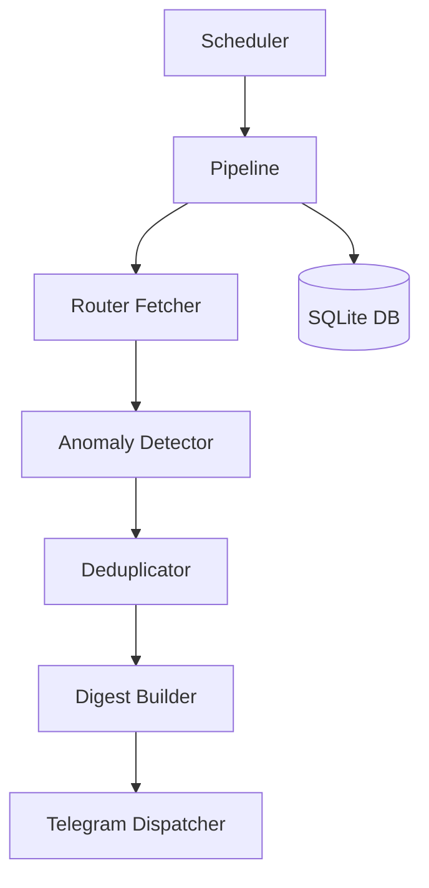

# Architecture

## System Design
The system follows a **Pipeline Orchestration** pattern with a scheduled tick (default 5-15 mins).

### High-Level Flow
1. **Entry Point**: `main.py` starts the `APScheduler`.
2. **Tick**: `src/scheduler/job_runner.py` triggers the `src/engine/pipeline.py`.
3. **Fetch**: `src/fetchers/router.py` attempts to get data from Dhan → NSE → Upstox.
4. **Detect**: `src/engine/anomaly_detector.py` runs pure-function rules against current vs previous snapshot.
5. **Dedup**: `src/alerts/dedup.py` suppresses repeat alerts within a 60-min window.
6. **Digest**: `src/alerts/digest.py` aggregates alerts into a single readable summary.
7. **Alert**: `src/alerts/telegram_dispatcher.py` sends the digest to Telegram.
8. **Persist**: `src/models/schema.py` saves snapshots and underlying prices to SQLite.

## Design Patterns
- **Router Pattern**: Decoupled data fetching with prioritized fallbacks.
- **Pure Functions**: Anomaly detection logic is separated from persistence and IO.
- **Append-only Persistence**: Snapshots are immutable and time-series based.
- **Digest-based Alerting**: Minimizes notification noise by grouping related alerts.

## Data Flow

