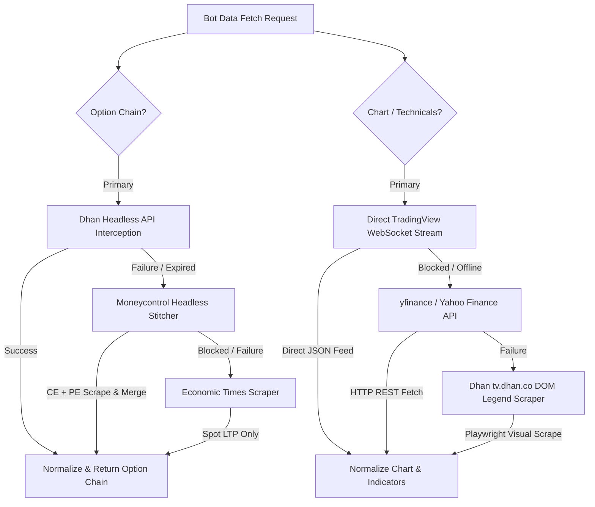

# Headless DOM Scraper & Data Extractor Implementation Plan (Revised)

This implementation plan details the architecture and step-by-step engineering design to build headless data extraction and parsing logic for the Trading Bot. 

Following the audit of three new data sources—**Economic Times**, **Moneycontrol**, and the **TradingView Scraper**—we have upgraded the architecture from fragile visual DOM scraping to a high-speed, direct-network and WebSocket-driven approach.

---

## Technical Feasibility & Analysis of New Sources

We analyzed the three proposed data sources for headless extraction feasibility:

| Data Source | Feasibility | Data Yield | Key Limitations / Challenges | Recommendation |
| :--- | :--- | :--- | :--- | :--- |
| **1. Economic Times Commodity Summary** | **Low** | Spot & Active Futures LTP only. | No strike-by-strike Option Chain. Heavy ad/tracker scripts. Fragile news-portal DOM. | **Fallback Only** for basic Spot price validation. |
| **2. Moneycontrol Option Chain** | **Medium** | Strikes, CE/PE LTP, Volume, OI, OI Change. | **Splits CE and PE into separate URLs** (`optyp=CE` vs `optyp=PE`). Heavy Cloudflare/Sucuri anti-bot protection. No Greeks or Implied Volatility (IV). | **Secondary Fallback** for Option Chains when Dhan is unavailable. |
| **3. mnwato/tradingview-scraper** | **Extremely High** | Real-time OHLCV, Technical Indicators (RSI, SuperTrend, etc.). | None (No browser needed). Connects directly to TradingView WebSockets. | **Primary Engine** for Technical Charts/Indicators. |

---

## Revised Data Collection Architecture

To ensure speed, correctness, and maximum resilience, the bot will employ a multi-layered data pipeline:



---

## Proposed Changes & Code Structures

### 1. Technical Chart Engine (WebSocket-Driven)

By utilizing the socket pattern from `tradingview-scraper` (or `tvdatafeed`), we bypass the HTML5 Canvas rendering completely. We connect directly to the TradingView WebSocket server (`wss://data.tradingview.com/socket.io/websocket`) to stream real-time price updates and indicator values without any browser overhead.

#### [MODIFY] [chart_fetcher.py](file:///C:/Users/manve/Downloads/NSEBOT/src/fetchers/chart_fetcher.py)
Update to integrate the direct TradingView WebSocket connection stream, using `tvdatafeed` as the primary driver, with automated fallbacks to `yfinance`.

---

### 2. Option Chain Scraper (Dual-URL Stitcher & Fallback)

To scrape Moneycontrol when Dhan is unavailable, we implement a **Stitched DOM Parser**. Because Moneycontrol isolates calls (`optyp=CE`) and puts (`optyp=PE`), we must execute concurrent requests to both URLs, parse their tables, and merge them on mutual strike prices.

#### [NEW] [moneycontrol_fetcher.py](file:///C:/Users/manve/Downloads/NSEBOT/src/fetchers/moneycontrol_fetcher.py)
A new option chain fetcher that implements the Moneycontrol DOM scraper.

```python
import logging
import asyncio
from bs4 import BeautifulSoup
from src.fetchers.base_fetcher import BaseFetcher

log = logging.getLogger(__name__)

class MoneycontrolFetcher(BaseFetcher):
    name = "moneycontrol"

    def __init__(self):
        super().__init__()
        # Moneycontrol requires standard browser headers to bypass basic user-agent blocks
        self.headers = {
            "User-Agent": "Mozilla/5.0 (Windows NT 10.0; Win64; x64) AppleWebKit/537.36 (KHTML, like Gecko) Chrome/120.0.0.0 Safari/537.36",
            "Accept": "text/html,application/xhtml+xml,application/xml;q=0.9,image/webp,*/*;q=0.8",
        }

    async def _fetch_url(self, url: str) -> str | None:
        """Helper to async-fetch HTML using Playwright or httpx to bypass bot barriers."""
        try:
            # We can use the existing Playwright browser session for headless loading
            from playwright.async_api import async_playwright
            async with async_playwright() as p:
                browser = await p.chromium.launch(headless=True)
                page = await browser.new_page()
                await page.set_extra_http_headers(self.headers)
                await page.goto(url, wait_until="networkidle", timeout=20000)
                content = await page.content()
                await browser.close()
                return content
        except Exception as e:
            log.error("[moneycontrol] fetch failed for %s: %s", url, e)
            return None

    def fetch_option_chain(self, symbol: str) -> dict | None:
        """Synchronous wrapper for integration with the existing fetchers pipeline."""
        return asyncio.run(self._async_fetch_option_chain(symbol))

    async def _async_fetch_option_chain(self, symbol: str) -> dict | None:
        # Convert NATURALGAS to moneycontrol slug: naturalgas
        mc_symbol = symbol.lower().strip()
        
        # Define URLs for CE and PE option chains
        # (Expiry and exchange are dynamically formatted or pulled from master)
        url_ce = f"https://www.moneycontrol.com/commodity/option-chain/{mc_symbol}?exchange=mcx&optyp=CE"
        url_pe = f"https://www.moneycontrol.com/commodity/option-chain/{mc_symbol}?exchange=mcx&optyp=PE"

        # Fetch CE and PE pages concurrently to reduce latency
        html_ce, html_pe = await asyncio.gather(
            self._fetch_url(url_ce),
            self._fetch_url(url_pe)
        )

        if not html_ce or not html_pe:
            log.error("[moneycontrol] Failed to fetch either CE or PE pages")
            return None

        # Parse tables
        ce_data = self._parse_table(html_ce, "CE")
        pe_data = self._parse_table(html_pe, "PE")

        # Merge datasets by strike price
        return self._merge_chains(symbol, ce_data, pe_data)

    def _parse_table(self, html: str, option_type: str) -> dict[float, dict]:
        """Extract strikes and indicators from Moneycontrol raw HTML."""
        soup = BeautifulSoup(html, "html.parser")
        table = soup.find("table", {"class": "table-responsive"}) or soup.find("table")
        if not table:
            return {}

        parsed = {}
        rows = table.find_all("tr")[1:]  # Skip header row
        for row in rows:
            cols = [c.get_text(strip=True) for c in row.find_all("td")]
            if len(cols) < 6:
                continue

            try:
                # Moneycontrol column layout parser (varies slightly by view)
                strike = float(cols[0].replace(",", ""))
                ltp = float(cols[1].replace(",", ""))
                volume = int(cols[3].replace(",", "") or 0)
                oi = int(cols[4].replace(",", "") or 0)
                oi_change = int(cols[5].replace(",", "") or 0)

                parsed[strike] = {
                    "strike": strike,
                    "option_type": option_type,
                    "ltp": ltp,
                    "oi": oi,
                    "oi_change": oi_change,
                    "volume": volume,
                    "iv": 0.0,      # Moneycontrol lacks real-time IV
                    "bid": 0.0,     # Moneycontrol lacks real-time bid/ask size
                    "ask": 0.0,
                }
            except ValueError:
                continue
        return parsed

    def _merge_chains(self, symbol: str, ce_data: dict[float, dict], pe_data: dict[float, dict]) -> dict | None:
        all_strikes = set(ce_data.keys()).union(pe_data.keys())
        if not all_strikes:
            return None

        strikes_list = []
        underlying_price = 0.0

        for strike in sorted(all_strikes):
            if strike in ce_data:
                strikes_list.append(ce_data[strike])
            if strike in pe_data:
                strikes_list.append(pe_data[strike])

        return {
            "symbol": symbol.upper(),
            "underlying_price": underlying_price, # Derived from active future LTP
            "expiry": "2026-05-22",               # Set active MCX expiry date
            "strikes": strikes_list,
            "source": self.name,
        }
```

---

### 3. Integrated Routing Config

#### [MODIFY] [router.py](file:///C:/Users/manve/Downloads/NSEBOT/src/fetchers/router.py)
Support routing to `moneycontrol` and `dhan_headless` sequentially.

```diff
+from src.fetchers.dhan_headless_fetcher import DhanHeadlessFetcher
+from src.fetchers.moneycontrol_fetcher import MoneycontrolFetcher

 def get_fetcher(source_name: str) -> BaseFetcher:
     if source_name == "dhan_headless":
         return DhanHeadlessFetcher()
+    elif source_name == "moneycontrol":
+        return MoneycontrolFetcher()
```

---

## Verification Plan

### 1. Chart Feed Verification
Validate connection speed and packet integrity of the direct socket stream:
```powershell
python -c "from src.fetchers.chart_fetcher import get_chart_fetcher; print(get_chart_fetcher().fetch('NATURALGAS'))"
```

### 2. Moneycontrol Stitched Scrape Verification
Confirm the dual-URL CE/PE fetcher can bypass the bot barrier and reconstruct a uniform option chain:
```powershell
python -c "from src.fetchers.moneycontrol_fetcher import MoneycontrolFetcher; print(MoneycontrolFetcher().fetch_option_chain('naturalgas'))"
```
Check that both CE and PE strikes are successfully parsed, aligned, and returned.
