# Trend-Following Strangle System (TFSS) & Core Engine Architecture

This document maps out the architecture and runtime execution path for the **Trend-Following Strangle System (TFSS)** and its integrations with the **Core Engine** and supporting modules.

## Architecture Flow Diagram

```mermaid
graph TD
    %% Styling Definitions
    classDef default fill:#1E1E2E,stroke:#CDD6F4,stroke-width:1px,color:#CDD6F4;
    classDef engine fill:#313244,stroke:#CBA6F7,stroke-width:2px,color:#CBA6F7;
    classDef signal fill:#313244,stroke:#89B4FA,stroke-width:1px,color:#89B4FA;
    classDef storage fill:#313244,stroke:#A6E3A1,stroke-width:1px,color:#A6E3A1;
    classDef execution fill:#45475A,stroke:#F38BA8,stroke-width:2px,color:#F38BA8;
    
    %% Intake & Regime Routing
    subgraph INTAKE ["1. Market Intake & Regime Evaluation"]
        A["Scan Event Trigger<br/>(hourly / --now)"] --> B["pipeline.py<br/>(process_symbol)"]
        B --> C["fetchers/<br/>(Underlying Price, Option Chain Data)"]
    end
    
    %% Core Trend Engine
    subgraph CORE_ENG ["2. Core Trend Engine (Direction & Regime)"]
        C --> D["trade_decision.py<br/>(evaluate_reversal / trend_continuation)"]
        D --> E{"Confirm Trend Direction"}
        E -- "Bullish" --> E1["Bullish Bias"]
        E -- "Bearish" --> E2["Bearish Bias"]
        E -- "Mixed / Unclear" --> E3["Neutral / Rangebound"]
        class D engine;
    end
    
    %% TFSS Options Management
    subgraph TFSS_STRENGTH ["3. TFSS (Trend-Following Strangle System)"]
        E1 --> F["Sell Put Options (PE Writing)<br/>(Collect premium on rising market)"]
        E2 --> G["Sell Call Options (CE Writing)<br/>(Collect premium on falling market)"]
        E3 --> H["Iron Condor / Neutral Strangle<br/>(Write OTM Call + OTM Put)"]
        
        %% Tranche Scaling
        subgraph TRANCHE_MGT ["Tranche Scaling & Execution"]
            F & G & H --> I["Strangle Strike Selector<br/>(Select OTM Strikes using ATR/Delta)"]
            I --> J["Evaluate Tranche Entry<br/>(First Tranche vs Scale-in Tranches)"]
        end
        
        %% Risk Management & Delta Checks
        subgraph RISK_GUARD ["Strangle Risk Guards"]
            J --> K["Tested-Side Delta Check<br/>(check_tested_side)"]
            K --> K1["Hard Stop Delta Threshold<br/>(Delta Stop Rule)"]
            K --> K2["Dynamic Strike Roll / Adjustments"]
        end
        class I,J,K engine;
    end
    
    %% AI Thesis & Sentiment Enrichment
    subgraph AI_ENRICHMENT ["4. LLM Enrichment Layer"]
        J -.-> L["llm_enrichment.py<br/>(get_llm_verdict / exit_advice)"]
        L --> L1["Synthesize catalysts, support/resistance,<br/>and options positioning"]
        L1 --> L2["Generate Non-Repetitive AI Thesis"]
        L2 --> L3["_enforce_engine_alignment()"]
        L3 -- "Enforce Directional Confluence" --> M["AI Thesis Block"]
        class L,L3 engine;
    end
    
    %% Execution Layer
    subgraph EXECUTION_LAYER ["5. Execution & Lifecycle Monitoring"]
        M --> N["trade_decision.py<br/>(combine_signals)"]
        K1 & K2 --> N
        
        N --> O{"Execution Filter<br/>(Time Guard / Risk Filters)"}
        O -- "Cleared" --> P["paper_trading.py<br/>(open_paper_trade)"]
        
        %% Global Trade Monitor
        P --> Q["pipeline.py: Global Trade Monitoring<br/>(Runs on EVERY scan)"]
        Q --> R["paper_trading.py<br/>(monitor_paper_trades)"]
        
        R --> S{"SL / Target Hit<br/>or Delta Stop Breached?"}
        S -- "Yes" --> T["close_paper_trade()"]
        
        %% AI Exit Advice Action
        Q --> U{"AI Exit Advice<br/>CLOSE_EARLY (HIGH)?"}
        U -- "Yes" --> T
        
        class P,R,T execution;
    end
    
    %% Database & State Management
    subgraph DB_STATE ["6. SQLite Persistence & Tracking"]
        T --> V[("SQLite DB<br/>(paper_trades, trade_history, scans)")]
        P --> V
        class V storage;
    end
```

---

## Core Mechanics of the Trend-Following Strangle System (TFSS)

### 1. Directional Scaling (Trend-Following Strangle Setup)
* Unlike delta-neutral strangles where Call and Put options are written at equidistant strikes, TFSS skews written strikes dynamically using **Core Engine directional sentiment**.
* **Bullish Bias**: The system prioritizes writing Put Options (PE) closer to the money (higher premium collection) while keeping written Call Options (CE) extremely deep OTM or omitting Call writing altogether.
* **Bearish Bias**: The system writes Call Options (CE) closer to the money (maximizing premium decay) and places written Put options far out of the money.
* **Neutral / Rangebound**: Default delta-neutral short strangle or Iron Condor configuration.

### 2. Strangle Strike Selector
* Computes optimal option strikes based on underlying spot prices, Average True Range (ATR) multipliers, and Option Chain delta levels.
* Manages first-tranche entries and checks if secondary scaling tranches are triggered.

### 3. Delta Stop Protection (`check_tested_side`)
* Monitors the delta of the written option legs dynamically.
* If the underlying price experiences a strong breakout against a written option leg and the tested-side delta crosses the hard stop threshold, the risk engine triggers a mechanical stop loss.

### 4. Global Trade Monitoring (Regime-Independent)
* The execution monitoring module (`monitor_paper_trades`) runs globally inside `pipeline.py` on **every single scan cycle**. This ensures that SL/Target breaches and high-urgency AI Exit Advice trigger immediate closeout actions, regardless of the active session regime (Event, Parity, Momentum, or Core).
