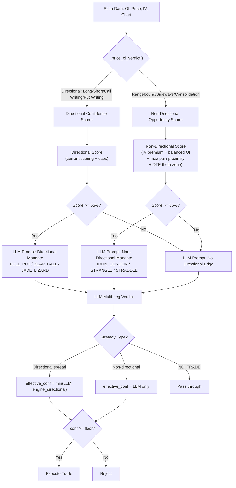

# NSEBOT Decision Engine Investigation: Directional Bias Leak Into Non-Directional Strategies

## Executive Summary

The bot's multi-leg strategy engine (Iron Condors, Strangles, Straddles) is **structurally crippled by three independent directional-bias gates** that were designed for single-leg naked options trades but are applied universally to all strategy types including non-directional ones. This creates a systematic blind spot: the market conditions most favorable for delta-neutral premium selling (flat price, balanced OI, elevated IV, rangebound consolidation) are precisely the conditions that the engine assigns its **lowest confidence scores**, causing every Iron Condor and Strangle setup to fail the confidence floor before it ever reaches the LLM.

---

## The Three Broken Gates

### Gate 1: `_price_oi_verdict()` — The Directional-Only Verdict Engine

**File:** [`intelligence.py:L232-L320`](file:///c:/Users/manve/VibeProjects/NSEBOT/src/engine/intelligence.py#L232-L320)

This function produces the `verdict_label` that cascades through the entire system. Its decision tree is:

```
price_up + OI pattern → "Long Buildup" / "Short Covering" / "Put Writing"   [BULLISH]
price_dn + OI pattern → "Short Buildup" / "Long Unwinding" / "Call Writing"  [BEARISH]
flat price + dominant OI side → "Put Writing" or "Call Writing"               [DIRECTIONAL]
flat price + balanced OI → "Sideways"                                         [NEUTRAL — PENALIZED]
both sides unwinding → "Sideways"                                             [NEUTRAL — PENALIZED]
```

> [!CAUTION]
> **There is no "Rangebound", "Consolidation", "Mean-Reverting", or "Theta-Favorable" verdict.** The only non-directional output is `"Sideways"`, which is treated as *absence of signal* rather than *presence of a different kind of opportunity*. An Iron Condor's ideal setup (balanced OI writing on both sides establishing a support floor AND a resistance ceiling simultaneously) gets classified as "Sideways" — semantically equivalent to "nothing is happening."

**Specific problem at `L267-L271`:** When price is flat and BOTH CE and PE are building in rough balance (the textbook strangle/condor setup — institutions writing premium on both sides), the 1.5x dominance ratio test fails, so it falls through to `"Sideways"`.

**Specific problem at `L316-L318`:** When both sides are unwinding (position squaring into expiry — a classic short straddle theta decay opportunity), the function returns `"Sideways"` with the comment "NOT a setup." This is incorrect: expiry-week position squaring with declining OI on both sides is precisely when ATM straddle sellers harvest maximum theta.

---

### Gate 2: `_apply_confidence_caps()` — The Sideways Death Sentence

**File:** [`intelligence.py:L535-L576`](file:///c:/Users/manve/VibeProjects/NSEBOT/src/engine/intelligence.py#L535-L576)

Three separate caps systematically destroy confidence for non-directional setups:

| Cap | Line | Condition | Effect | Impact on Non-Directional |
|:----|:-----|:----------|:-------|:--------------------------|
| **Flat+Balanced OI** | L547-L555 | `abs(price_pct) <= 0.05` AND OI ratio < 1.5x | `score = min(score, 65)` | **Catastrophic.** This is the IDEAL Iron Condor/Strangle condition. Capped at 65% before any other scoring. |
| **Sideways Verdict** | L573-L575 | `verdict_label == "Sideways"` | `score = min(score, 50)` | **Fatal.** After Gate 1 labels it "Sideways", Gate 2 hard-caps confidence to 50%. NSE floor is 70%, MCX floor is 72%. **No non-directional trade can EVER pass.** |
| **Both-Sides Unwinding** | L557-L571 | `ce_chg < 0 AND pe_chg < 0` AND unwind_ratio >= 70% | `score = min(score, 45)` | **Fatal.** Expiry-week theta decay with position squaring is capped to 45%. |

The cascading effect:

```
Balanced OI writing on both sides (ideal condor)
  → _price_oi_verdict() returns "Sideways"
  → _apply_confidence_caps() hard-caps to 50%
  → multileg_paper_trading effective_confidence = min(50, LLM_conf) ≤ 50%
  → 50% < 70% NSE floor / 72% MCX floor
  → REJECTED at LLM_CONFIDENCE_GATE
  → Zero Iron Condors entered
```

---

### Gate 3: `_compute_confidence()` Scoring Itself is Directional

**File:** [`intelligence.py:L579-L612`](file:///c:/Users/manve/VibeProjects/NSEBOT/src/engine/intelligence.py#L579-L612)

The additive scoring model awards points exclusively for directional signal confluence:

| Component | Function | What earns points | Non-directional score |
|:----------|:---------|:------------------|:---------------------|
| Base | — | Always 10 | 10 |
| Alert severity | `_score_alert_severity` | HIGH alerts **aligned with verdict bias** | Neutral bias → reduced weighting |
| PCR confluence | `_score_pcr_confluence` | PCR < 0.75 AND price > 0 (bullish) OR PCR > 1.25 AND price < 0 (bearish) | **Always 0** when price is flat |
| Level proximity | `_score_level_proximity` | Price near support AND price > 0 (bouncing) OR price near resistance AND price < 0 (rejection) | **Always 0** when price is flat |
| Chart alignment | `_score_chart_alignment` | Chart sentiment matches verdict bias | Neutral verdict → **0** |

**For a perfect non-directional setup** (flat price, balanced OI, IV elevated, near max pain):
- Base: 10
- Alert severity: ~8-20 (alerts exist but bias is NEUTRAL so weighting is diluted)
- PCR: 0 (flat price → fails the directional price check)
- Level proximity: 0 (flat price → fails directional bounce/rejection test)
- Chart: 0 (neutral verdict → no alignment bonus)
- **Raw score: ~18-30** → then capped to 50 by Sideways verdict → **ALWAYS rejected**

---

### Gate 4: The `min(engine, LLM)` Confidence Formula

**File:** [`multileg_paper_trading.py:L905-L910`](file:///c:/Users/manve/VibeProjects/NSEBOT/src/engine/multileg_paper_trading.py#L905-L910)

```python
effective_confidence = min(llm_conf, engine_conf)
```

Even if the LLM correctly identifies a viable Iron Condor at 85% confidence based on the option chain, IV surface, and expected move calculation, the `min()` formula drags it down to the engine's directional confidence of 30-50%. The engine's opinion of directional conviction is applied as a veto on non-directional strategy viability.

---

### Gate 5: LLM Prompt Directional Mandate

**File:** [`multileg_llm_prompt.py:L394-L415`](file:///c:/Users/manve/VibeProjects/NSEBOT/src/engine/multileg_llm_prompt.py#L394-L415)

When the engine confidence IS high (≥65%) AND directional:

```python
if is_strong_bull:
    directional_mandate = """
    *** QUANT ENGINE MANDATE: HIGH-CONVICTION BULLISH ***
    • DO NOT construct delta-neutral straddles, strangles, or bear spreads...
    """
elif is_strong_bear:
    directional_mandate = """
    *** QUANT ENGINE MANDATE: HIGH-CONVICTION BEARISH ***
    • DO NOT construct delta-neutral straddles, strangles, or bull spreads...
    """
```

This explicitly **prohibits** the LLM from selecting non-directional strategies when the engine is directional. The only path to an Iron Condor or Strangle is:
1. Engine is NOT strongly directional (< 65% confidence) → but then engine confidence is low
2. Engine IS directional → mandate bans non-directional structures
3. Engine is "Sideways" → confidence capped to 50% → fails floor

**Every path is blocked.**

---

## What Should Actually Trigger Each Strategy Category

### Category A: Non-Directional / Range-Bound Strategies

**Strategies:** `IRON_CONDOR`, `SHORT_STRANGLE`, `SHORT_STRADDLE`

**Correct Entry Conditions (these should INCREASE confidence, not decrease it):**

| Signal | Meaning | Scoring Impact |
|:-------|:--------|:---------------|
| Flat price (`abs(pct) < 0.05`) | Low realized volatility → theta edge | **+15** (currently caps to 65) |
| Balanced OI buildup both sides | Institutions writing premium on both sides = support AND resistance | **+20** (currently treated as "no signal") |
| Price near max pain | Expiry magnet effect → range compression | **+10** (already partially awarded) |
| Elevated ATM IV vs historical | IV overpricing realized movement = selling edge | **+15** (not scored at all today) |
| DTE in theta sweet spot (5-15 days) | Peak theta decay acceleration | **+10** (not scored today) |
| PCR near 1.0 (balanced) | Neither side dominant → mean reversion | **+10** (currently earns 0 — only extreme PCR scores) |
| Both sides unwinding into expiry | Position squaring = theta harvest window | **+15** (currently PENALIZED to 45 cap) |

### Category B: Directional Strategies

**Strategies:** `BULL_PUT_SPREAD`, `BEAR_CALL_SPREAD`, `JADE_LIZARD`

**Correct Entry Conditions (the current system handles these adequately):**

| Signal | Meaning |
|:-------|:--------|
| Strong directional OI verdict (Long Buildup, Call Writing, etc.) | Clear institutional positioning |
| Price trending with OI confirmation | Momentum + conviction |
| High engine confidence (≥ 70%) | Multiple directional factors aligned |
| Chart alignment with OI direction | Timeframe confluence |

---

## Exactly Where The Separation Is Missing

### Location 1: `_price_oi_verdict()` needs a "Rangebound" verdict

[`intelligence.py:L266-L320`](file:///c:/Users/manve/VibeProjects/NSEBOT/src/engine/intelligence.py#L266-L320)

Before falling through to "Sideways", the function should detect **balanced premium-selling setups**:

```python
# PROPOSED: Detect rangebound / premium-selling opportunities
if pe_oi_change > 0 and ce_oi_change > 0:
    ratio = max(abs_pe, abs_ce) / max(min(abs_pe, abs_ce), 1)
    if ratio < 2.0:  # Both sides building in rough balance
        return "Rangebound", "🟣", "Neutral — dual-side OI writing (strangle/condor territory)"
```

### Location 2: `_apply_confidence_caps()` must exempt non-directional verdicts

[`intelligence.py:L535-L576`](file:///c:/Users/manve/VibeProjects/NSEBOT/src/engine/intelligence.py#L535-L576)

The `Sideways` cap at 50% and the flat+balanced OI cap at 65% must not apply when the *downstream consumer is a non-directional strategy selector*. These caps were designed to prevent naked directional bets on ambiguous signals — they are correct for that purpose. But they are wrong when applied as a universal gatekeeper.

### Location 3: `_compute_confidence()` needs non-directional scoring factors

[`intelligence.py:L579-L612`](file:///c:/Users/manve/VibeProjects/NSEBOT/src/engine/intelligence.py#L579-L612)

Missing additive factors for non-directional setups:
- IV percentile vs. 20-day average (elevated IV = selling edge)
- Max pain proximity bonus (price near max pain = range compression)
- DTE theta acceleration zone (5-15 DTE)
- Balanced PCR (near 1.0) as a positive signal rather than zero

### Location 4: `effective_confidence = min(llm, engine)` needs strategy-aware logic

[`multileg_paper_trading.py:L905-L910`](file:///c:/Users/manve/VibeProjects/NSEBOT/src/engine/multileg_paper_trading.py#L905-L910)

For non-directional strategies selected by the LLM, the engine confidence should NOT veto. The correct formula:

```python
is_nondirectional = st_upper in ("IRON_CONDOR", "SHORT_STRANGLE", "SHORT_STRADDLE")
if is_nondirectional:
    # For non-directional: LLM's assessment of IV, chain quality, and expected move
    # is the primary authority. Engine directional confidence is irrelevant.
    effective_confidence = llm_conf
else:
    # For directional spreads: require both engine and LLM agreement
    effective_confidence = min(llm_conf, engine_conf) if (engine_conf > 0 and llm_conf > 0) else llm_conf
```

### Location 5: LLM Prompt directional mandate needs a non-directional path

[`multileg_llm_prompt.py:L394-L415`](file:///c:/Users/manve/VibeProjects/NSEBOT/src/engine/multileg_llm_prompt.py#L394-L415)

When engine confidence is LOW or verdict is Sideways/Rangebound, the prompt should explicitly encourage non-directional strategies instead of remaining silent:

```python
if not is_strong_bull and not is_strong_bear:
    directional_mandate = f"""
*** QUANT ENGINE: NO DIRECTIONAL EDGE ({verdict_label} {confidence}%) ***
• The engine detects no strong directional conviction.
• Candidate Strategy Priority: SHORT_STRANGLE, IRON_CONDOR, SHORT_STRADDLE
• These non-directional strategies profit from TIME DECAY and IV OVERPRICING,
  not from price movement. Flat/rangebound is the IDEAL condition.
• Verify: ATM IV is elevated enough to justify premium sold.
• Verify: Short strikes sit safely outside spot ± expected move.
"""
```

---

## Proposed Architecture: Dual-Mode Decision Engine



---

## Summary of Root Causes

| # | Root Cause | File | Lines | Severity |
|:--|:-----------|:-----|:------|:---------|
| 1 | No "Rangebound" verdict — only "Sideways" (treated as no-signal) | `intelligence.py` | L232-L320 | **Critical** |
| 2 | Sideways verdict hard-capped to 50% confidence | `intelligence.py` | L573-L575 | **Critical** |
| 3 | Flat price + balanced OI hard-capped to 65% | `intelligence.py` | L547-L555 | **Critical** |
| 4 | Both-sides unwinding hard-capped to 45% | `intelligence.py` | L557-L571 | **High** |
| 5 | Confidence scoring awards 0 for flat price, balanced PCR, near max-pain | `intelligence.py` | L480-L509 | **High** |
| 6 | No IV-based scoring factor at all | `intelligence.py` | L579-L612 | **High** |
| 7 | `min(engine, LLM)` vetoes non-directional strategies via directional score | `multileg_paper_trading.py` & `multileg_live_trading.py` | L905-L910 / L1231-L1233 | **Critical** |
| 8 | LLM prompt bans non-directional strategies when engine is directional | `multileg_llm_prompt.py` | L394-L415 | **High** |
| 9 | LLM prompt baseline forces anchoring confidence to directional score | `multileg_llm_prompt.py` | L492-L498 | **Critical** |
| 10 | Hardcoded ban on IRON_CONDOR for MCX commodities | `multileg_strategy.py` | L118-L120 | **High** |
| 11 | Missing Rangebound registration in verdict sets and digest style | `verdict_sets.py` & `digest.py` | L28-L55 / L33-L43 | **High** |

---

## Production-Hardened Execution Safeguards

1. **Dual Execution Parity (`multileg_paper_trading.py` AND `multileg_live_trading.py`)**:
   Both paper and live runners decouple `effective_confidence` for non-directional strategies (`IRON_CONDOR`, `SHORT_STRANGLE`, `SHORT_STRADDLE`).
2. **Directional Safety Guard (`CORE`)**:
   Directional confidence remains untampered for single-leg naked strategies. When `verdict == "Rangebound"`, `CORE` single-leg options are blocked (`is_bullish("Rangebound") == False` and `is_bearish("Rangebound") == False`), while non-directional strategies evaluate `Rangebound` as a high-conviction theta setup.
3. **Prompt De-Anchoring**:
   In `multileg_llm_prompt.py`, when evaluating non-directional setups, LLM confidence is anchored to IV overpricing, strike safety outside expected move, and option liquidity, independent of directional engine conviction.
4. **Contract Synchronization**:
   Register `"Rangebound"` in `src/engine/verdict_sets.py` (`_OI_NEUTRAL`), `src/alerts/digest.py` (`_VERDICT_STYLE`), `src/engine/paper_plan.py` (`VERDICT_ACTION_MAP`), and `src/engine/intelligence.py` (`_generate_trade_idea`).
5. **MCX Commodity Distinction**:
   Non-directional setups for MCX commodities (`NATURALGAS`, `CRUDEOIL`) are routed to `SHORT_STRANGLE` or `SHORT_STRADDLE`, respecting the `multileg_strategy.py:L119` constraint against illiquid wing contracts in commodity Iron Condors.

