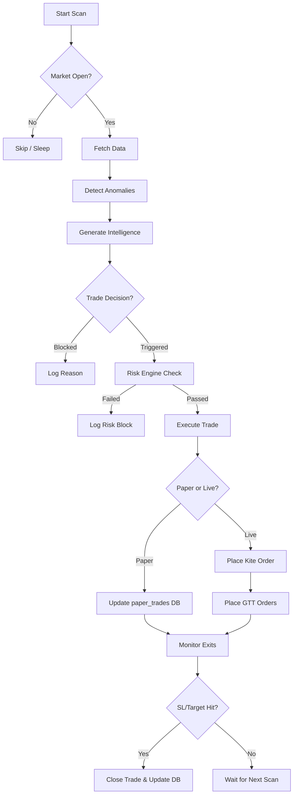

# NSEBOT Order Flow & State Machine

## 1. The Lifecycle of a Trade

### Phase 1: Signal Generation
*   **Trigger:** `anomaly_detector.py` identifies a pattern (e.g., Long Buildup).
*   **Validation:** `intelligence.py` assigns a confidence score and checks for chart conflicts.
*   **Decision:** `trade_decision.py` applies the "Hybrid" filter, checking trend persistence and regime scores.

### Phase 2: Risk & Planning
*   **Risk Check:** `risk_engine.py` verifies daily limits, max positions, and cooldowns.
*   **Plan Creation:** `paper_plan.py` calculates the specific strike, SL, and Target based on ATR or key levels.
*   **AI Enrichment:** If enabled, `llm_enrichment.py` generates a structured trade plan with entry triggers and invalidation points.

### Phase 3: Execution (Paper vs. Live)

| Step | Paper Trading (`paper_trading.py`) | Live Trading (`live_trading.py`) |
| :--- | :--- | :--- |
| **Entry** | Logs to `paper_trades` table with status `OPEN`. | Places Limit order on Kite Connect. |
| **Confirmation** | Immediate fill at current LTP. | Polls broker for `COMPLETE` status. |
| **Exit Management** | Premium polling every scan cycle. | Places GTT (OCO) orders for SL/Target. |
| **Closure** | Updates DB with `CLOSED_SL` or `CLOSED_TARGET`. | Cancels GTT and places square-off order if needed. |

---

## 2. State Machine Diagram

---

## 3. Error Handling Paths

### Broker Failures
*   **IP Whitelist Error:** Detected by `_handle_kite_ip_error()`; logs public IP and provides resolution steps.
*   **Order Rejection:** If Kite returns `REJECTED`, the trade status is updated in the DB and a Telegram alert is sent.
*   **GTT Failure:** If GTT placement fails, the bot switches to "POLL" mode, manually checking premiums every scan to exit the trade.

### Data Failures
*   **All Fetchers Down:** The pipeline skips the symbol and sends a high-priority Telegram alert.
*   **Stale Underlying:** If the price is missing, the bot uses the previous known price but tags the row as `is_fallback=1` to prevent it from poisoning the Regime Detector.

---

## 4. Key Configuration Points for Order Flow

*   **`FETCHER_PRIORITY`:** Defines the order of data sources. Changing this can improve reliability for specific symbols.
*   **`TREND_FILTER_MODE`:** Switches between "conservative", "balanced", "aggressive", and "hybrid" logic.
*   **`LIVE_SHADOW_MODE`:** When `True`, live trading logic runs but orders are suppressed (logged only). Essential for testing new strategies.
*   **`AI_DECISION_MODE`:** Controls whether the LLM can veto trades or only provide advice.

This document ensures that any future modifications to the order flow maintain the integrity of the state machine and error handling protocols.
